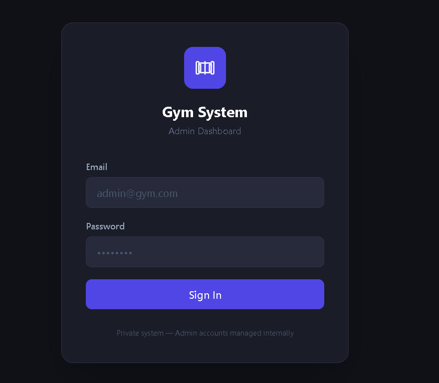
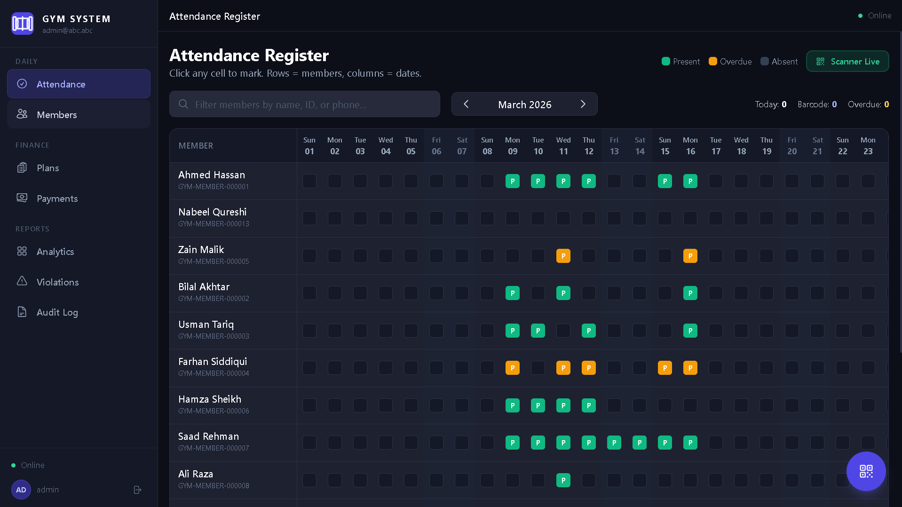
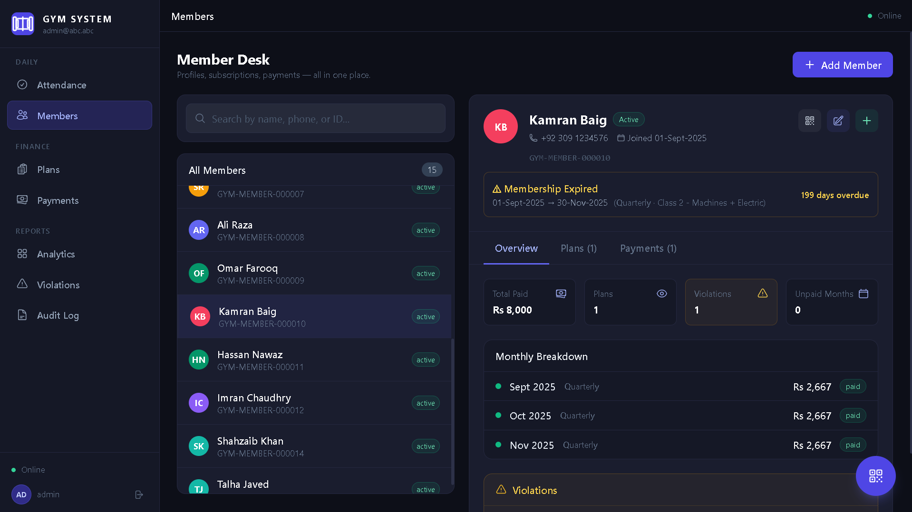
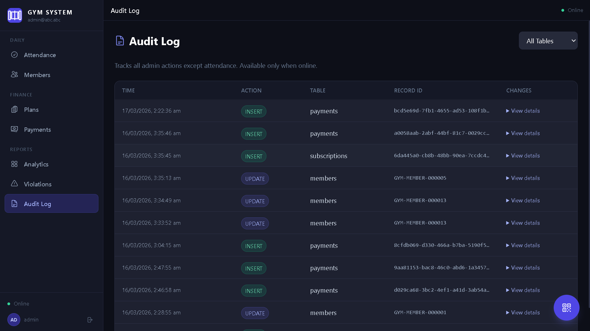
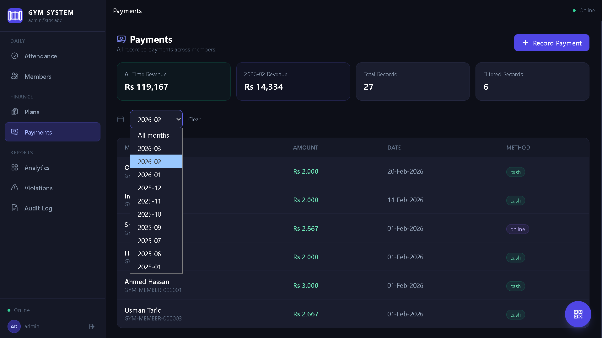
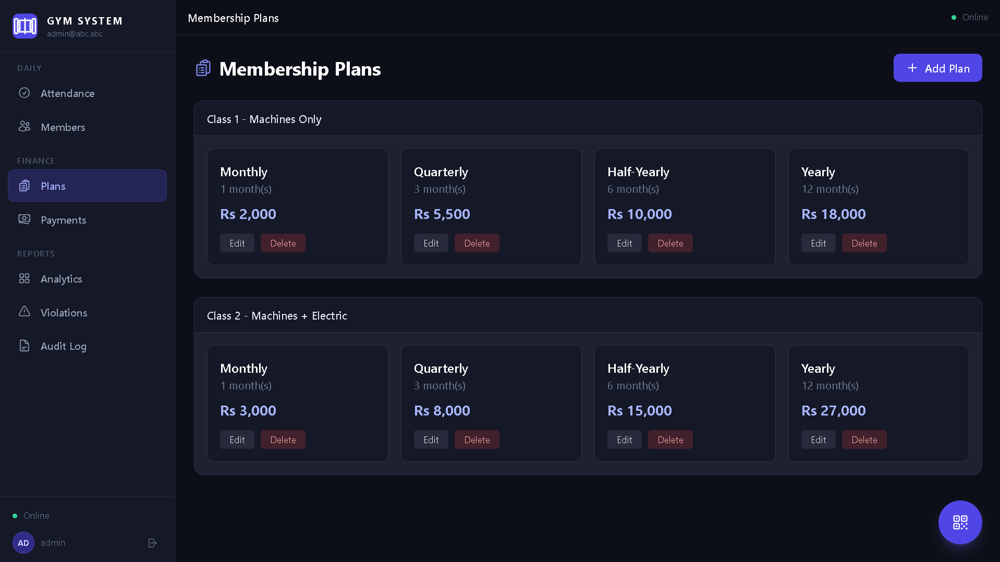
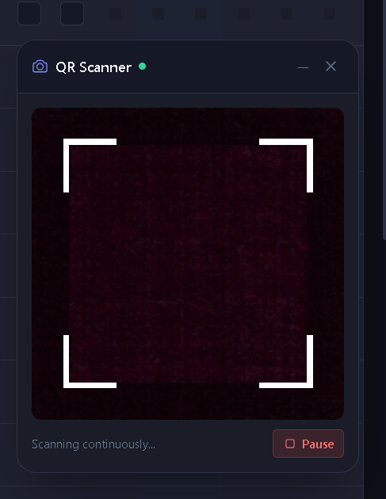
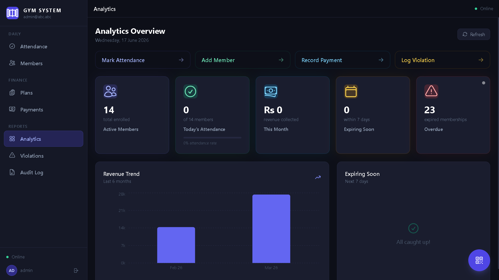
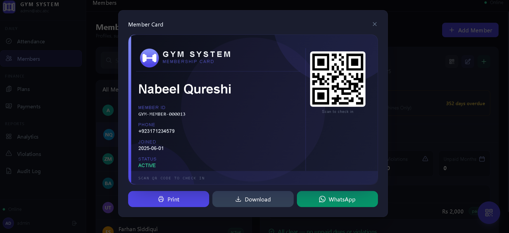

# GymTrack — Gym Membership Manager

A private gym management system for internal use by gym owners and admins, with offline-first support and barcode-based attendance tracking.

---

## Why I Built This

A local gym needed to replace paper attendance registers and manual fee tracking with something reliable that still works when the internet drops. The offline-first design — caching member data in IndexedDB and auto-syncing once reconnected — was the part I'm proudest of, since gym front desks can't afford downtime just because Wi-Fi blinks.

---

## Tech Stack

- **Frontend:** React 18, Vite, Tailwind CSS
- **Backend/DB:** Supabase (PostgreSQL)
- **Offline Storage:** IndexedDB (via `idb`)
- **Charts:** Recharts
- **Barcode:** JsBarcode

---

## Features

- **Membership plans** — configurable plan types (monthly, quarterly, yearly) with custom pricing per plan
- **Member management** — add, edit, and search members with phone number normalization and returning-member auto-detection
- **Active/inactive member list** — view all members filtered by current membership status
- **Block unpaid members** — flag and block members who haven't paid their fee from checking in
- **Violation tracking** — surfaces members who attend without an active paid membership, tracks how many days/visits this has happened so admins can decide when to block them
- **Attendance** — manual entry or barcode scanner, one check-in per day, overdue warnings
- **Payments dashboard** — full payment history by method and date, with revenue breakdown
- **Change log** — tracks the history of all admin actions and changes made in the system
- **Barcode membership cards** — auto-generated, printable cards with a scannable barcode for entrance check-in; cards can also be sent directly to a member's WhatsApp
- **Offline-first** — IndexedDB caching for members, attendance, subscriptions, and payments with auto-sync on reconnect
- **Dashboard & audit log** — active members, attendance, revenue, expiring/overdue stats, and full admin action history

---

## Access

This is a private admin tool with real operational data, so it isn't publicly hosted. If you'd like to explore the live system, reach out for demo credentials:

- **Email:** mubeenahmerbali@gmail.com
- **LinkedIn:** [linkedin.com/in/mubeen-ahmer](https://www.linkedin.com/in/mubeen-ahmer-2b162b344/)
- **Portfolio:** [mubeenahmer.vercel.app](https://mubeenahmer.vercel.app/)

---

## Usage

**Barcode scanner:** connect a USB/Bluetooth scanner, go to the Attendance page, click "Enable Barcode Scanner," and scan a member's card. The scanner auto-fills the member ID and attendance is marked with duplicate/overdue checks.

**Membership cards:** each member gets a printable card with a unique barcode generated automatically. Cards can also be sent directly to the member's WhatsApp.

**Offline mode:** if the connection drops, the app keeps working off IndexedDB — search members, mark attendance, create subscriptions, record payments. Everything syncs back to Supabase automatically once you're back online, using last-update-wins conflict resolution.

---

## Project Structure

```
gym-system/
├── assets/                   # Screenshots and demo media for README
├── public/
├── src/
│   ├── components/
│   ├── config/
│   ├── contexts/
│   ├── hooks/
│   ├── pages/
│   ├── utils/
│   ├── App.jsx
│   ├── index.css
│   └── main.jsx
├── .env.example
├── .gitignore
├── index.html
├── package.json
├── postcss.config.js
├── tailwind.config.js
├── vite.config.js
└── README.md
```
--- 

# Screenshots & Demo












<!-- > **Video demo:** [Watch on Google Drive / YouTube](#) ← paste your link here -->
